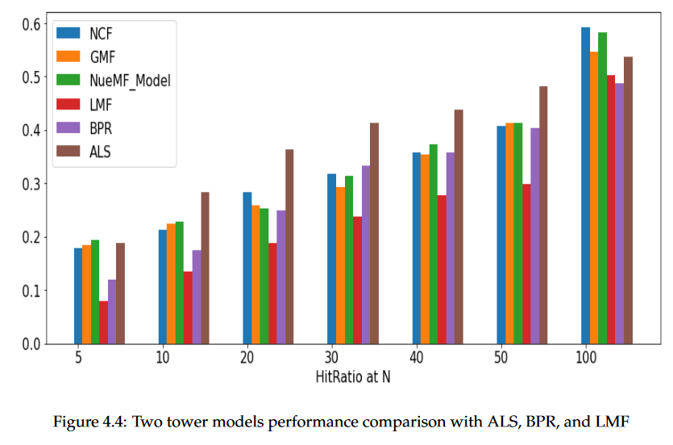

# Propenity_Modelling_For_Wine_Company

## Directory Structure
- [propensity_modelling.ipynb](./propensity_modelling.ipynb): Notebook contains comparitive study about various statistical ways of comingup with the best suitable model for the task.
- [charts](./charts): Contains all the charts that were drawn on this project.

# Summary
In this project, we have created a recommendation model which upon giving a product
can generate a list of potential customers who might be interested in the product. Recom-
mendations are generated along with a confidence score which shows how relevant that
recommendation is. The data we have dealt with is implicit in nature as it just has the cus-
tomer’s purchasing history and we have explored various ways to deal with it. We explored
the Bayesian personalized ranking and ALS implicit recommendation model, which are spe-
cially designed to deal with implicit data and make good recommendations. Eventually, we
tried embedding-based two-tower deep learning models to build a recommendation system.
We have tried exploring different architectures of it such as MLP based, Matrix Factoriza-
tion based and the one, in which we have combined MLP and Matrix Factorization based
architectures together. We tried changing the objective function to check which objective
function (binary cross-entropy of right interaction or mean square error on frequency) gives
us better performance. To improve the performance, we tried engineering new features such
as recency, frequency, and monetary for both customers and products. Eventually, I compared
the result of these deep learning models with the popularity-based model, alternating least
squares and Bayesian personalized ranking model using the metric called HitRatio.

# Business Problem and Its Soluton
XYZ is one of the largest specialist retailer of wine. Occasionally
it has an excess inventory of wines that it wants to get rid of. The problem is how to
identify customers who might be interested in buying a particular wine. Once it has a list of
customers who might be interested in certain wines, it may contact/email those customers
and sell out that excess inventory. To attract more customers, it might also give targeted
offerings/discounts.
One of the solutions to this task is to create a propensity model for given categories of
products. This model will use customer’s historical behavior to predict their likelihood of
purchasing these products. That means the model will create, for every customer, a propensity
score for each of the agreed categories of product.
An appropriate way to accomplish this task is to create a recommendation model, which can
generate a list of customers, who might be interested in buying a given product. Along with
these recommendations, this model will also be generating a propensity score to show how
confident the system is in recommending each customer.

# Matrix factorization
Matrix factorization is one of the most popular approaches to implement collaborative
filtering. In matrix factorization, a large user-item sparse matrix is
decomposed into two smaller dense matrices using some MF techniques such as ALS,
SVD, or SVD++. One of these two matrices denotes only users in reduced vector space
in which each row relates to a specific user and another smaller matrix denotes only items
in the same vector space in which each row relates to a specific item. Once these smaller
matrices are learned, missing values can be predicted by multiplying these matrices again.

The main goal while trying to learn smaller matrices is to minimize the below loss
function

Where ru i is the actual rating, pu is a vector representing a specific user in smaller
vector space and qi is a vector representing a specific item in smaller vector space, λ is the
regularization hyper parameter, (∥p2u∥ + ∥q2i∥) is the regularization term with L2 norm.
This objective function can further be modified in various ways as stated in depending
on the data we are dealing with. In the paper, the author has suggested two approaches
namely SGD and ALS to minimize the above loss function.

# Implicit Data
As the name suggests, Implicit data is collected implicitly without asking the user to rate
the product explicitly. it is the purchases that a user makes, videos that he watches, or items
that he views or clicks. No matter which type of interaction is it, if a user has interacted with
an item, we call it positive feedback from the user given to that item even if the user has
interacted just once. Below is an image of implicit feedback interaction matrix Y

Where yu i shows the interaction between user and item. yu i is equal to 1 shows the user liked
the item, whereas yu i equal to 0 does not show any preference about the user. Note with this
formulation, if a user has not interacted with an item, it does not mean s/he disliked the item.
It might be that the user was not aware of this item. Similarly, if a user has interacted with an
item just once we are not sure if s/he has actually liked the item. Because of this uncertainty
in user preference, the matrix factorization technique which we discussed above will give
poor result with implicit data.

# Evaluation Techniques
You can use various techniques to come up with multiple recommendation models, but the
selection of one among them requires some sort of evaluation. There are various techniques
that nowadays can be used to evaluate the recommendation model performance offline,
among them I have described one below-

## HitRate@rankN:
the process of calculating the hit rate is as below[11]-
For each user, first, we remove an item with which the user has actually interacted and use
the remaining interactions for the training recommendation system. Once trained, use the
recommendation model to recommend N items for each user out of the total items available
in the database including the one which you had earlier taken out. If taken away item is
inside top n recommendations for a user, then it is a hit for that user. we then sum all the hits
and divide that by the number of users. The obtained number is called the hit rate.

# Dataset
The data I am going to work on has 3 important data files. One file contains all the information
related to customers, another file contains all the information related to products and the third
file contains all the detail related to any transactions that have been made by any customer
on any product. There are a total of 8 million transactions for 250,000 customers and 6600
products. Transnational data has the same customer and product combination multiple
times but on different timestamps showing that a customer has bought the same product
multiple times. I have pre-processed the transnational data to have a unique customer and
product combination with the information of a total number of times this product was bought
by the customer. Note that the same customer and same product might occur multiple
times individually in the pre-processed dataset, but the combination of them will be unique
across the dataset. I have created few two-tower model architectures in which I have used
customer and product context information as well and to do that I have merged pre-processed
transnational dataset obtained above with the customer file and product file on the basis of
customer code and product code respectively.

# Models
Note that we need to create a recommendation model, which does not only recommends
costumers given an input product but also generates a propensity(confidence) score between
0 to 1. I first have started implementing ALS Implicit, BPR, and Logistic Matrix Factoriza-
tion(LMF) models. Python already has an implementation of all of these models. The only
problem in using these models is that they do not generate confidence score between 0 to 1.
Still i will use all of these models for performance comparison. I then have started building
two-tower deep learning recommendation models. The advantage of using these models is
that if we use sigmoid activation function at the last layer of them, they will generate a score
between 0 to 1, which we can consider as confidence score. To verify how good these two
tower models are, i have verified their performance against ALS, BPR, LMF and popularity
based models. Below i have discussed in detail about all the models that i have tried.

# ALSimplicit and Logistic Matrix Factorization model
Then I have started building ALSimplicit and Logistic Matrix Factorization model (discussed
in the literature review section earlier), which is specially designed to create a recommenda-
tion model using implicit data and provide recommendations in ranked order. These models
have two hyperparameters α and dimension of latent factor matrix. α is the parameter used
to calculate the confidence depending on the number of times user u has interacted with
an item i. This confidence is then used to give weightage to user-item preference. I have
selected the number of latent factors to be 32 and α = 40. To train these models, we first need
to convert dense user-item interaction matrix into sparse matrix form. The model expects
items to be the rows of sparse matrix and users to be the columns of the sparse matrix where
each cell of this matrix will contain the number of times a user has interacted with the item.

# Bayesian personalized ranking model
I then have tried the Bayesian personalized ranking model (discussed in the literature review
section earlier), which tries to maximize the margin between observed user-item interactions
and unobserved user-item interactions. The objective of this model is to rank observed inter-
actions higher than unobserved interactions. This model has one important hyperparameter
which is the dimension of the latent factor matrix. For this model too, I have considered
the factor’s dimension to be 32. Like ALS implicit and Logistic model, this model expects
user-item interaction matrix in a similar format, but each cell of it does not necessarily need
to contain user-item interaction count. Internally this algorithm transforms all non-zero cells
to contain just 1 to show the user-item interaction.

# Embedding Based Two Tower models

## Role of embeddings in two tower model
An embedding in deep learning is used to represent a large set of categorical values in a
small dimensional space such that values similar to one another have similar embedding
vectors. Because of their capability of putting similar items together, they play an important
role in designing a two-tower recommendation model. What happens internally is that users,
whose liking for items is similar, come closure in embedding space. Similarly, items, which
are liked by the same set of users come closure to each other. This potential of embedding
layer enables us to find similar users and items given an input user or item respectively.
Because each dimension of the embedded vector represents a certain attribute, by doing a
dot product between user and item embedding vectors, we can tell how similar user an item
vectors are.

## GMF
With GMF two-tower modeling, I have tried implementing matrix factorization using
embedding vectors obtained for each input user and item. Once the user and item embedding
vectors are obtained, I am calculating the dot product of these vectors and then feeding this
product inside the sigmoid function. The sigmoid function generates a score between 0 to 1
which I am considering as the probability of user-item interaction being a positive interaction.
Below is the architecture of GMF.

As you can see it has two towers. One tower is responsible for learning user features. Tt
has separate input and embedding layers dedicated to the user. Similarly, another tower is
responsible for learning user features. It has its own input and embedding layers. Output
embedding vectors obtained from both user and item embedding layers are of the same
length and that’s why we can perform dot product operation between them and send the
result in the last layer.

## MLP

MLP variant of two tower architecture involves three MLP hidden layers with Relu
activation function. The notion behind implementing this model is that it might identify
even more complex patterns in data with the help of the nonlinear activation function Relu.
Similar to the above one, this model too has two towers; one responsible for learning user
information and another for item information, but unlike the earlier one where embeddings
were being multiplied to get the dot product, here they are simply being concatenated and
then concatenated layer is following 3 hidden layers with 8 neurons, 4 neurons, and 2 neurons.
All of these layers have Relu activation function. Lastly, in the output layer with 1 neuron,
sigmoid is being used to get the probability of a user-item pair being a positive one. Below is
the architecture of MLP two tower.

## NeuMF
In NeuMF two-tower architecture, I am fusing GMF two-tower model and MLP two-
tower model together so that it has all the qualities of matrix factorization and complex MLP.
Equal weightage has been given to both the GMF and MLP model outputs which are being
concatenated in the next layer and then sigmoid is being used in the last layer to predict the
probability of positive user-item interaction.

### Feeding side information in two-tower
One of the advantages of using two tower modeling is that feeding context information
related to user and item becomes very easy. Now from user tower, instead of just feeding
customerid I will also feed customer type. From product/item tower, instead of just feeding
product id I will also feed product type. Below is an image GMF two-tower with side
information-

### Feature Engineering
RFM modelling is one of the popular approaches of segmenting customers in different
groups. Keeping in mind different groups of customers might behave differently, I have
engineered 6 new features. these features are customer recency, customer frequency, customer
monetary, product recency, product frequency, product monetary.
Customer Recency : Date when the customer made his latent transaction,
Customer Frequency: How many times so far, customer has made transaction,
Customer Monetary: How much money customer has spent so far,
Product Recency: Date when the latest transaction happened for this product,
Product Frequency: How many times this product has been bought,
Product Monetary: How much money has been spent so far on this product.

# Results and Discussion

I started by first using python inbuild ALS Implicit, BPR, and Logistic matrix factorization
model (available in the implicit library of python) and found that ALS implicit perform the
best among them. For all of these models, the latent dimension was 32. Below is the result-

The above plot is showing the hit rates of all the models at different ranks. X-axes denotes
rank and Y-axes denotes HitRate.

Then I compared how well these models are when compared to popularity-based models,
and I got the below result-

As you can see, all of these models are way better than the popularity-based model(
Represented by the red color horizontal line).
After this, I tried implementing tower models (GMF, MLP, and NueMF(Fused model of
GMF and MLP)). First, I tried training these models using binary cross-entropy loss, and I
found that MLP based two-tower model(NCF) has performed slightly better than the other
two models(GMF and NueMF). Below is the result

I also compared the performance of these models against ALS, BPR, and LMF models
used earlier and found that all two-tower models were better than BPR and LMF but not as
good as ALS. Below is the result-

